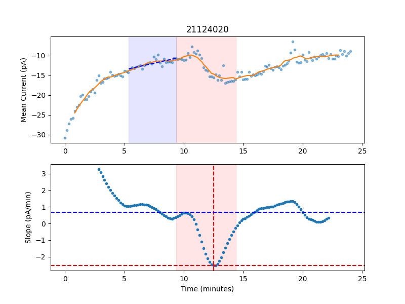

# Holding Current Slope Analysis

This project aims to determine maximum drug effect (change in holding current) relative to a baseline.

### Analysis Steps
* Calculate `Ih` for each sweep
* Low-pass filter the data points (`filterSize`)
* Calculate slope for each point using a moving window linear regression (`regressionSize`)
* Define baseline and drug times based on ABF tags
* Define baseline slope using the linear regression of the baseline period
* Define drug slope as the peak negative slope during the drug period
* Report drug effect as drug slope relative to baseline slope

### Example Analysis
